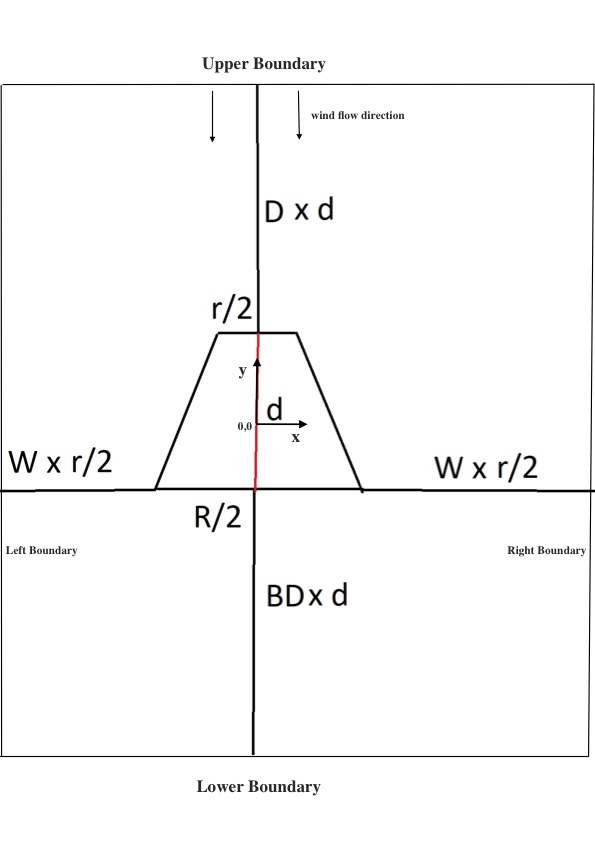
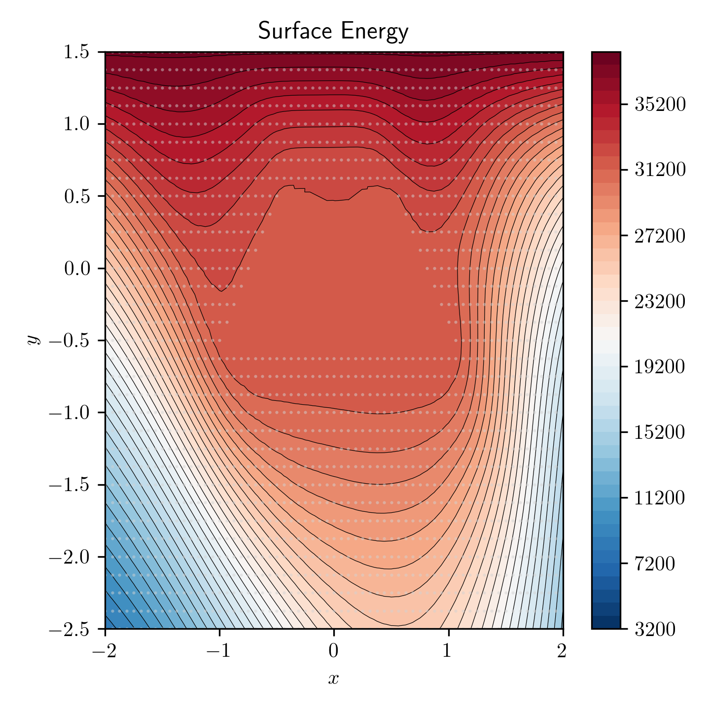
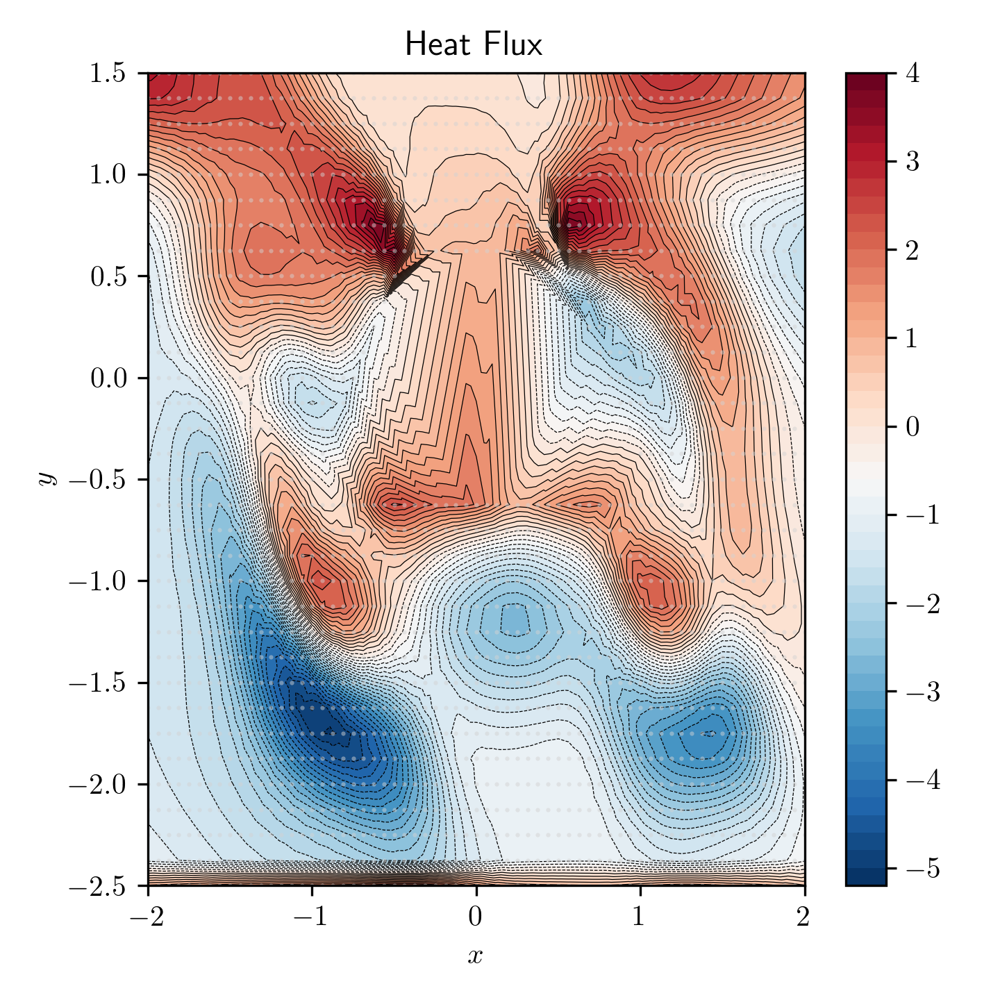

# Wind Tunnel Simulator 
**This code is part of a challenge proposed to me by Inductiva Labs. This code
is all mine, but reflects their original proposal and idea.**

In this code we construct a wind tunnel for a 2D-truncated cone
parametrized according to the user input (base, height and top) dimensions
and wind velocity.
It uses SU2 open source finite-element code to calculate important
physical quantities such as surface energy or heat flux.

## Running instructions, in order

- Install Docker.
- Install Flask.
- Install Python 3.7 or above, and have an environment where you can run python code
- Install the py-packages needed for the code (check the "imports"), including Flask
- Clone SU2 code [https://github.com/su2code/SU2]() to a working directory
- In the same directory, to create the container, run:

        docker run --name SU2Container -ti --rm -v $PWD:/workdir/  -w /workdir --entrypoint bash su2code/build-su2
        
        note: you can try to pull the code and install it 
        using the pre-made scripts in the SU2 doc, 
        but there are several issues and incompatibilities as of now

- Within the container, install python 3.7 or above. Make sure to update Python3 package (run python3 --version to confirm).
- Within the container, install mpi4py:

           apt-get install pkg-config;
           apt-get install python3-distutils

- Within the container, enter the SU2 root folder and run the compilation and installation scripts:
            
            ./meson.py build;
            ./ninja -C build install
            
- In your working directory, where SU2 was cloned, create a folder named "SU2HomeRun"

- In the root folder of this code, run the script:

        ./set_flask_vars

- Run the source code located in
            
      /source/run.py
      
      note: if you don't use an IDE like pycharm or intellij, 
      please redo the "imports" so they become absolute instead of
      relative (since relative imports are deprecated in python3)

- Go to the local server host:

        http://192.168.1.67:5000/ 
            
- Set the input values and press submit.

- Input values constraints:

        R is integer positive
        r is integer positive and < R
        d is integer positive
        wind velocity > 0
       
- Input conditions for the SU2 computation, such as Temperature,
farfield, reynolds number, reference length, etc. are under the output folder,
in "Iam_cone_ref.cfg" file.

- Results coming from the SU2 calculation are under the output folder, in the file 
"surface_flow.csv" file. History of convergence is at the same place, named "history.csv".
        
- Additional note:

    You may want to change the source code for it to run in parallel using SU2 py scripts, for instance to run the 
    "parallel_computation.py" script, located in SU2_PY, inside SU2 code. For that, you have 
    to allow docker to run as root. I changed the file "interface.py" located under "SU2/SU2_PY/SU2/run", 
    in the line 60, to read:
    
                    mpi_Command = 'mpirun --allow-run-as-root -n %i %s'

         
## Physical definition of the problem: 

A 2-D simulation of a cone inside a wind tunnel. The geometry is explained below:

All dimensions are in SI. 

- d is the cone distance along its symmetry line.
- r is the cone minor radius. Natural number.
- R is the cone major radius. Natural number.
- D sets the distance from the top of the cone to the upper boundary. Natural number.
- BD sets the distance from the bottom of the cone to the lower boundary. Natural number.
- The coordinate system (0,0) is set in the cone geometrical center.
- The inlet is considered to be the upper boundary, with the air flowing in the -y direction.

The grid is defined as follows:

- Each cell has dimensions dx * dy .
- dx = (r/2) / (a * beta) .
- dy = d / b .
- 'a' is an even integer > 2, which tunes how fine the mesh is in the x direction 
- 'b' is an even integer > 2, which tunes how fine the mesh is in the y direction 
- beta = R/r

The mesh was defined with triangular nodes, and the far-fields
with line-nodes.

- note: 

   the grid was defined as above so that the nodes could overlap the upper 
   and lower vertices of the cone. Also, for its dimensions to be divisors 
   of r/2 and d, the characteristic lengths of the problem in the 
   x and y direction, respectively. The evenness of a and b comes from the symmetry
   of the problem. 

Output examples:

## TODO and final thoughts / self-criticism:
Todo:
- Input validation.
- Error handling.
- Validate output with actual real-scenario physical estimations.
- Tweak convergence parameters. Research more about their significance and how they may adapt to this specific
situation.
- Recreate the problem to withstand non-integer r and R. It is just a matter of normalization.
- Find some other mesh-creation algorithms. Possibly adaptive mesh near the cone, for finer computation along the edges.

Some thoughts:
- I have dealt with a problem I am definitely not used to, and one that I didn't work for a long time. 
While I have studied some other relevant .cfg files and meshes as guidance, my lack of experience led me to 
some difficulty to understand which convergence parameters were best to use.
This is especially important in such a volatile domain as CFD codes, where conditions such as the far-field
distances, initial velocity/momentum/pressure (and other), position of the inlets/outlets, boundary width and/or mesh
definitions, etc. Can make a huge difference in the code convergence.

- I have mainly followed the config files of
 [laminar plate](https://github.com/su2code/Tutorials/blob/master/compressible_flow/Laminar_Flat_Plate/lam_flatplate.cfg)
 and [laminar cylinder](https://github.com/su2code/Tutorials/blob/master/compressible_flow/Laminar_Cylinder/lam_cylinder.cfg).
 Laminar plate configuration defines an inlet and outlet, with associated pressures.
 Laminar cylinder defines only the farfield. **I have tried different combinations of these approaches.
 When using inlet/outlet, the only time I managed to find a configuration where I fixed the correct direction of 
 the flow, when the the simulation ran a large amount of iterations, reverse flow started to appear. 
 I assume this is a common problem in CFD, and probably has to do with ill-defined boundaries and initial 
 conditions. I tried to widen up the boundaries, but it didn't work. The only combination that worked, and converged, 
 was by changing the Angle of Attack and setting only the farfield only as a boundary. Even though, as it 
 can be seen in the figures above, there is still a lack of symmetry which shouldn't
 exist in this symmetrical setup.**
 
- I noticed some convergence improvement when playing with CFL_NUMBER and CFL_ADAPT_PARAM.

- I have an odd feeling that SU2 has some bias towards a +x flow direction. If so, it was a poor choice of coordinates,
but I only realized this too late, and didn't have the time to rotate the geometry.
Setting flow direction (inlet or initial velocity) in the cfg MARKERS didn't work, only the AOA gave me the expected
results. Found one entry of this issue online.

- There is some commented code that I left on purpose, for further discussion. 

- In all honesty, and due to the lack of time, I have first tried some input conditions that could give some
plausible physical results, focusing on the results-visualization only. 
**However, and since I am a physicist, it only makes sense to me to try to produce
results with physical significance. I therefore lay down some example of possible initial conditions 
to explore the convergence of SU2 with more time, concerning the study of a realistic situation, which eventually
was the one I used in the code I am delivering:**

    - An 3 m wide inlet, with air flowing with a velocity v of 10 m/s; 
    Inlet pressure is given by P = 0.5 * rho_air * v^2 ~ 60 Pa
    -  Air kinematic viscosity (visc): 1e-5 ; Reference Length (L) : r = 1; wind speed (U): 10;
     Typical Reynolds for this problem  LU/visc = 1e+6.
     
     